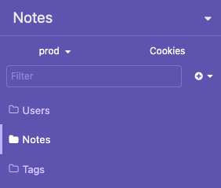

# Insomnia

You can execute all the APIs using [Insomnia](https://insomnia.rest) by downloading, unzipping and importing the <a id="raw-url" href="assets/Insomnia.json.zip">Notes API Definitions</a> file into Insomnia. Everything is set up and ready to go. While the APIs can return either JSON or XML, all Insomnia requests are setup to return JSON.

##### Import the Notes API Definitions

1. Download the <a id="raw-url" href="https://github.com/wkande/notes/raw/master/docs/assets/Insomnia.json.zip">notes-insomnia.json</a> file.

1. Unzip the downloaded file if needed.

1. Choose **Preferences** from the Insomnia Menu.

1. Select the **Data** tab.

1. Select **Import Data** > **From File**.

1. Locate and import the **Notes API Definitions** file.

    

#### Try Authenticating

Be sure you are using the **prod** environment.

1. Select: **Users** folder > **Create a Code** endpoint >  **Send** button > enter your **Email Address**.

1. Get the **Code** from your email application.

1. Select: **Users** folder > **Get a Token** endpoint > **Send** button > enter your **Code**.

A **JWT Token** has now been added to the Insomnia ENV and you can now make other API calls.

#### Get your Notes

When you authenticated a note was created for you.

1. Select: **Users** folder > **Get user's Notes** endpoint > **Send** button.

