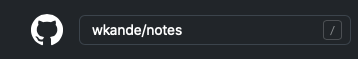

# What is Notes?

Welcome to **Notes**, a demonstration project created by Warren Anderson using the 
[**docs-like-code**](https://www.docslikecode.com/about/) philosophy to create product documentation. 

The Notes project utilizes a fully functional Node.js 
backend to host REST APIs and Redis for data storage. Using their email address a user can log in and create simple notes that can be searched 
by content and tags.

Documentaion for **Notes** has been created with **Stoplight**, **ReDoc** and **Docsify**. StopLight and ReDoc both use an industry standard OpenAPI specification file while Docsify 
uses a loose collection of markdown files. As with docs-like-code practices, all three have their source stored in a version control repository.

#### Source Code

The **wkande/notes** repository contains the API source code. 

- [**wkande/notes**](https://github.com/wkande/notes)

Check the [releases](https://github.com/wkande/notes/tags) section of the wkande/notes repo for release information.

#### Documentation Source

Three separate repositories contain the **Documentation** for each of three different documentation frameworks. 

- [**StopLight**](https://github.com/wkande/notes-stoplight)
- [**ReDoc**](https://github.com/wkande/notes-redoc)
- [**Docsify**](https://github.com/wkande/notes-docs-v1.1)